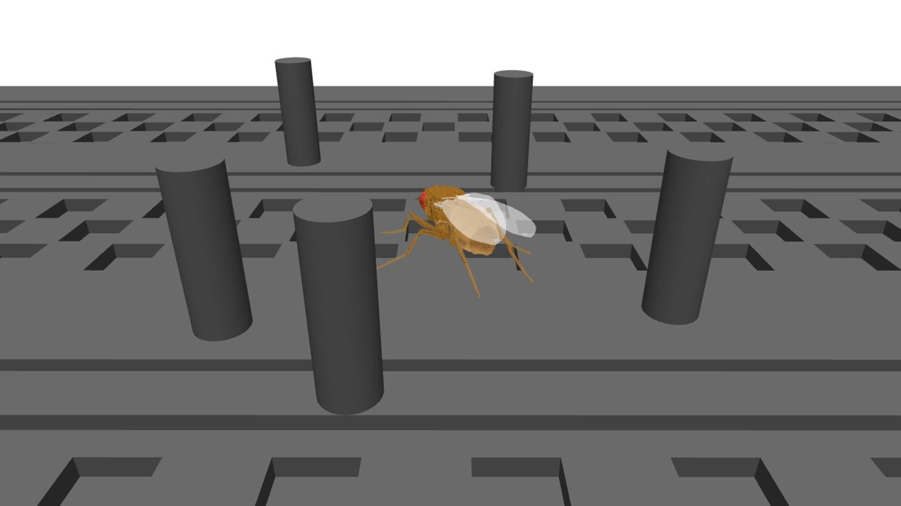
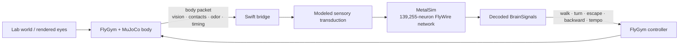
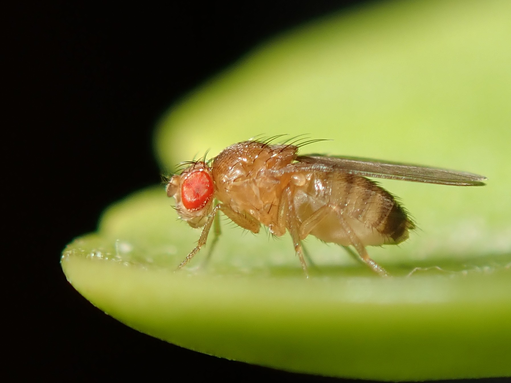

# SiliconFly V2

<p align="center">
  <strong>A connectome-driven virtual fruit-fly laboratory for macOS.</strong><br>
  FlyWire whole-brain simulation in Metal, coupled in closed loop to a FlyGym / NeuroMechFly body in MuJoCo.
</p>

<p align="center">
  
  
  
  
</p>

<p align="center">
  
</p>

SiliconFly V2 turns the original SiliconFly desktop fly into an interactive **virtual fly lab**. The brain side runs the shipped FlyWire v783 connectome as a 139,255-neuron spiking network on the GPU. The body side runs a real NeuroMechFly v2 model in FlyGym / MuJoCo. A bidirectional bridge connects neural outputs to locomotion and sends measured body, vision, contact and environmental state back into the neural simulation.

The goal is not to fake convincing animal behavior. V2 is built so that you can see where a response came from: **source → modeled sensor → receptor activity → brain output → controller → measured motion**.

---

## V2 at a glance

| Layer | Current V2 implementation |
|---|---|
| Brain | 139,255 FlyWire neurons, 15,091,983 signed edges, 1 kHz LIF simulation in Metal |
| Body | FlyGym 2.1 / NeuroMechFly v2 / MuJoCo with real body dynamics and contact feedback |
| Closed loop | Swift ↔ Python NDJSON bridge with freshness, timing, reconnect and bounded queues |
| Vision | Real left/right FlyGym eye renders, brightness/occupancy and generic optic-expansion decoding |
| Olfaction | Food-source geometry → bilateral modeled odor → FlyWire `ORN_DM1` + `ORN_VA2` |
| Wind | Physical thorax force plus modeled `JO-C*` / `JO-E*` neural drive |
| Temperature | Environment-only, locomotor-tempo model, or FlyWire `TRN_VP2` / `TRN_VP3a+b` drive |
| Touch | Physical body-part impulse plus a separately labeled generic neural startle/touch channel |
| Experiments | Presets, direct neural stimulation, live graphs, markers and CSV/event recording |

---

## The lab

The V2 Lab window is organized around five jobs rather than around implementation details:

**World** — spawn and move boxes, spheres, walls and food markers; approach objects toward the fly; reset the world or body.

**Stimuli** — cover either eye, flash an eye, apply wind, touch the thorax/head/abdomen/legs, and change temperature mode.

**Brain** — directly stimulate selected neural populations such as GF, DNa, MDN, DNp09, DNg11, LC4/LPLC2 and the currently exposed sensory receptor groups.

**Live Data** — inspect source state, receptor drive/spike rates, decoded `BrainSignals`, left/right controller output, packet age, sim/wall timing and measured body motion.

**Experiments** — run built-in looming/wind/touch/direct-neural presets, add trial markers, replay the previous preset and record telemetry to disk.

The UI deliberately separates three kinds of intervention:

- **PHYSICAL** — real MuJoCo geometry or force.
- **SENSORY-MODEL** — an explicit engineering transduction into identified neural populations.
- **DIRECT-NEURAL** — current injection that bypasses the sensory transduction step.

That distinction matters: a physical touch to the left front leg is a body-specific MuJoCo event, while the current V2 neural touch path is only a **generic modeled startle/touch channel**. The UI does not present those as the same thing.

---

## Closed-loop architecture



The bridge does not substitute a procedural translation for real FlyGym locomotion. In real-body mode the physical motion comes from the FlyGym controller and MuJoCo simulation. Stale body feedback is rejected rather than silently replayed as current sensory state.

---

## What you can test

### Vision and looming

The fly uses FlyGym's rendered left/right eye frames. V2 measures brightness and occupancy and also estimates outward edge motion from the raw frames after compensating for small whole-frame translation. The generic optic-expansion estimator is useful for arbitrary rendered objects; it is an **engineering approximation**, not a biological reconstruction of retinal motion processing.

Regression tests explicitly suppress common false loom cases including contraction, camera pan and full-field flash. Covering and reopening either eye is also tested through the real rendered path.

### Food / odor

Food markers are physical scene markers with a modeled odor source. Concentration is computed from source geometry and fly pose, split bilaterally, then injected into identified FlyWire `ORN_DM1` + `ORN_VA2` populations. Removing the source or receiving stale body feedback clears the drive.

There is intentionally **no taste, reward, feeding, or scripted food-seeking behavior** in V2.

### Wind

Wind can independently enable:

- a physical force on the MuJoCo thorax;
- a modeled sensory path into outgoing `JO-C*` / `JO-E*` populations.

The wind direction → neural current mapping is a model assumption, not a measured antennal transfer function.

### Touch

Touch can apply a real impulse to the thorax, head, abdomen, or any named leg. The current neural side is deliberately labeled as a generic modeled startle/touch channel rather than body-part-specific tactile physiology.

### Temperature

V2 exposes three modes:

- `environment_only` — records temperature; no neural input;
- `modeled_physiology` — adjusts locomotor tempo through the real FlyGym controller;
- `flywire_sensory` — drives identified warm/cool FlyWire populations (`TRN_VP2`, `TRN_VP3a`, `TRN_VP3b`).

---

## Quick start

### Requirements

- Apple Silicon Mac
- Xcode Command Line Tools / Swift toolchain
- Python 3.12
- FlyGym 2.1.0 and its MuJoCo dependencies

### 1. Clone and build

```sh
git clone https://github.com/parkjaeyoungcovid19-hue/siliconfly.git
cd siliconfly
./build.sh
```

### 2. Create the FlyGym environment

```sh
/opt/homebrew/opt/python@3.12/bin/python3.12 -m venv flygym-venv
./flygym-venv/bin/pip install -r flygym_bridge/requirements.txt
```

If your Python 3.12 lives somewhere else, use that interpreter instead.

### 3. Launch the full V2 lab

From Finder, the recommended entry point is:

```text
SiliconFly 실험실.command
```

CLI equivalent:

```sh
./run_flygym.sh --flygym
```

The launcher starts the Python bridge, the real FlyGym / MuJoCo backend, SiliconFly and the Lab window. A cold FlyGym viewer launch can take a while to prewarm; SiliconFly keeps retrying the connection while the backend initializes.

For development without the real body:

```sh
./run_flygym.sh --mock
```

---

## Recording experiments

The Lab can record trials under:

```text
~/Documents/SiliconFlyExperiments/experiment-YYYYMMDD-HHMMSS/
├── metadata.json
├── events.jsonl
└── telemetry.csv
```

Telemetry includes neural rates, modeled sensory drive, receptor EMA spike rates, decoded brain state, controller output, body velocity/contact state, vision values, body packet age and simulation timing. `Baseline`, `Stimulus ON`, `Stimulus OFF`, and `Observation` markers make repeated trials easier to compare later.

---

## Validation status

The current V2 tree has been exercised through the full Swift and Python regression set, including the real MuJoCo body and rendered-eye path:

```sh
./build.sh
./SiliconFly --labtest
./SiliconFly --bridgetest
./SiliconFly --simtest
./SiliconFly --behaviortest

./flygym-venv/bin/python flygym_bridge/test_bridge.py
./flygym-venv/bin/python flygym_bridge/test_lab.py
./flygym-venv/bin/python flygym_bridge/test_lab_real.py
./flygym-venv/bin/python flygym_bridge/test_vision_real.py
```

The final full launcher validation on the development M2 Air sustained roughly **40–41 body packets/s**, **~60 brain packets/s**, no long stale-body gaps, and approximately **0.79–0.83× simulation-time / wall-time** while the real viewer and GUI were open. The UI explicitly reports degraded body feedback if it drops below 30 Hz.

These measurements are machine-specific observations, not a guaranteed benchmark.

---

## What is measured, what is modeled

SiliconFly V2 combines real data, simulation and explicit engineering mappings. Those are not interchangeable.

**Directly grounded in existing data / runtime state**

- FlyWire v783 neural identities and connectivity shipped with the repository;
- real FlyGym / MuJoCo body state and contacts;
- real rendered eye frames from the FlyGym cameras;
- actual bridge timing/freshness and controller output;
- actual receptor/network spikes produced by the implemented simulation after a modeled input is injected.

**Engineering/modeling assumptions in V2**

- scalar odor → neural current gain;
- temperature → TRN current mapping;
- wind direction/strength → JO-C/E current mapping;
- generic touch/startle neural channel;
- raw-frame optic-expansion estimator;
- descending-neuron readout → FlyGym locomotor-controller mapping.

The project is therefore best used for **controlled comparisons inside the same model** rather than as a claim that every intermediate quantity is a measured biological transfer function.

---

## Repository map

```text
.
├── main.swift                     app coordinator / brain ↔ body loop
├── MetalSim.swift                 GPU FlyWire spiking simulation
├── FlyGymBridge.swift             Swift TCP bridge and body feedback
├── LabWindow.swift                Virtual Fly Lab UI
├── LabProtocol.swift              lab state / telemetry / tests
├── ExperimentRecorder.swift       events + CSV recording
├── flygym_bridge/
│   ├── bridge.py                  Python server
│   ├── fly_body.py                mock + real FlyGym body
│   ├── lab_world.py               world / stimuli / source state
│   ├── vision_decoder.py          rendered-eye decoder
│   └── test_*.py                  Python regression suite
├── VIRTUAL_FLY_LAB_GUIDE.md       full V2 user guide
├── VIRTUAL_FLY_LAB_V2_FIX_PLAN.md repaired V2 defect checklist
└── VIRTUAL_FLY_LAB_V3_PLAN.md     future work; not implemented in V2
```

For detailed controls and exact preset values, see **[VIRTUAL_FLY_LAB_GUIDE.md](VIRTUAL_FLY_LAB_GUIDE.md)**. Bridge internals and protocol details are in **[flygym_bridge/README.md](flygym_bridge/README.md)**.

---

## Upstream work and credits

This repository started from **[SiliconFly](https://github.com/dawsonamf/siliconfly)** by Dawson Metzger-Fleetwood, which itself credits **[DesktopFly](https://github.com/DenisSergeevitch/desktop-fly)** by Denis Shiryaev for the original desktop fly / overlay foundation.

V2 additionally integrates:

- **[FlyWire](https://codex.flywire.ai/)** connectome data;
- **[FlyGym / NeuroMechFly v2](https://neuromechfly.org/)** by the Ramdya Lab / EPFL;
- **[MuJoCo](https://mujoco.org/)** for body physics.

Please cite the relevant upstream projects and papers when using their data or models in research.

### Images used in this README

- `docs/images/neuromechfly-v2.jpg` — simulated NeuroMechFly v2 scene, credit **Ramdya laboratory, EPFL**, **CC BY-SA 4.0**: <https://actu.epfl.ch/news/simulating-how-fruit-flies-see-smell-and-navigat-4>.
- `docs/images/drosophila-melanogaster.jpg` — *Drosophila melanogaster* photograph by **Alexis** (`alexis_orion` on iNaturalist), **CC BY 4.0**, Wikimedia Commons: <https://commons.wikimedia.org/wiki/File:Drosophila_melanogaster_53362116.jpg>.

<p align="center">
  
</p>

---

## License

Source code is MIT-licensed as described in [LICENSE](LICENSE). Connectome-derived data under `data/` has separate licensing; see `data/DATA_LICENSE.md`.
