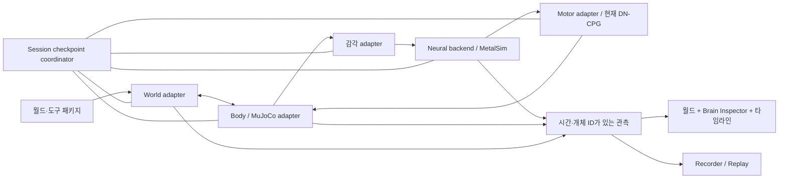

> 보존용 이전 설계. **버전 순서와 범위는 폐기됨**. 현재 정본은 [V4–V14 로드맵](../plans/VIRTUAL_FLY_LAB_ROADMAP.md)이다. 아래 상태와 번호는 당시 기록이다.

# Virtual Fly Lab — 모듈형 전뇌파리 장기 로드맵 (V3–V16+)

상태: **V3 IMPLEMENTATION COMPLETE / V4 READY TO IMPLEMENT / V5+ PLANNED** · 수정: 2026-09-13
기준: V2 `447f7e234f91ec44da4e2e68ada50a00859f4375`
정본: Git 저장소의 `docs/plans/VIRTUAL_FLY_LAB_ROADMAP.md`. 각 버전의 실제 작업 범위는 같은 폴더의 버전별 구현 계획을 따른다.

**이 문서는 여러 버전에 걸친 목표 계약이다. 아래 기능 전체를 V3에서 구현하지 않는다.** 사용자 요청에 따라 버전별 작은 변경과 검증을 우선한다. 일정이나 버전 번호보다 안정성 gate를 우선하며 필요하면 버전을 더 쪼갠다.

## 1. 최종 목표와 플랫폼의 역할

최종 목표는 **외부에서 가져온 환경 안에서 감각–신경계–몸–환경의 폐루프로 상호작용하고, 신경 활동을 탐색하며, 개체와 실험을 보존·교환할 수 있는 모듈형 가상 초파리**다. 목표 종은 현재 데이터에 맞춰 Drosophila melanogaster로 명시한다. 실제 집파리와 동일한 종으로 설명하지 않는다.

기존의 감각 두 개 추가 계획을 **월드/도구/개체/기록 패키지, 교체 가능한 모듈 계약, 뉴런 탐색, 재현성**을 순차 구축하는 장기 계획으로 확장한다. 습도·접촉 미각은 이 모듈 구조를 실제로 검증하는 응용 기능으로 유지한다.

“실제 파리와 같은 전뇌”는 장기 연구 목표다. 플랫폼 출시에 전 생물학적 동등성, 의식, 실제 개체의 기억 복제, 완전한 학습·섭식·비행을 주장하지 않는다. 현재 LIF 연결망, 감각 변환, DN→보행 제어기는 모델이다. 모델 안의 실제 계산값과 살아 있는 동물에서 측정한 값을 구분한다.

### 목표별 현재 격차

| 목표 | V2 코드에서 확인한 상태 | 플랫폼 필수 결과 |
|---|---|---|
| 외부 환경과 상호작용 | 고정된 box/sphere/wall/food 슬롯, MuJoCo 몸체 | 파일 기반 월드/도구 import/export, 실제 충돌·시각·감각 경로 |
| 뉴런 활성의 직관적 표시 | 전체 soma 점군 + 샘플링된 스파이크 반짝임 | root ID 검색/선택, 정확한 선택 뉴런 측정, 랭킹·래스터·타임라인 |
| 같은 개체 가져오기 | 초기 seed와 reset은 있음; 완전한 checkpoint 없음 | 개체 정체성, 상태 저장/복원, 새 환경으로 이식, 복제 계보 |
| 기록 가져오기 | CSV/events export, preset 재실행 | 관찰 재생과 재시뮬레이션 구분, portable experiment package |
| 모듈형 신경계 | Coordinator/MetalSim/FlyGym에 V2 경로 결합 | 버전·capability·snapshot 계약, 기존 구현을 adapter로 감싸기 |
| 실제 파리와의 비교 | 소프트웨어 내부 회귀와 공학적 조율 | 별도 생물학적 benchmark, holdout/여러 seed/제거 대조 실험 |

## 2. 생물학적 근거와 변경 원칙

1. FlyWire v783는 **V2 기준 데이터셋**으로 고정한다. 전체 뇌 연결도가 세포별 동역학·말초 수용기·전신 운동 제어를 모두 제공하는 것은 아니다. 연결 수를 기능적 시냅스 강도와 동일시하지 않는다. [FlyWire network statistics](https://www.nature.com/articles/s41586-024-07968-y)
2. 기존 v783 데이터와 Role 계약을 임의로 바꾸지 않는다. 감각 이름은 데이터셋의 정확한 cell type 및 root ID로 해석하고, 누락 시 해당 기능을 비활성화한다. “반응이 나오게” 가짜 뉴런·회로·좌우 분류를 넣지 않는다.
3. “v783만 영원히 사용”은 모듈형 목표와 충돌하므로 철회한다. 미래 데이터셋은 별도 adapter, namespace, 버전, provenance로 추가한다. v783의 root ID와 타 데이터셋의 ID를 섞지 않는다.
4. 몸 제어의 장기 확장 후보로 BANC를 검토한다. 2026년 뇌와 복측신경삭을 함께 다룬 연구와 공개 데이터 안내가 있다. 플랫폼에서 즉시 교체하지 않고 공개 snapshot·라이선스·세포 대응·계산비용을 먼저 평가한다. 서로 다른 개체/성별의 신경계를 임의로 이어 붙이지 않는다. [연구](https://www.nature.com/articles/s41586-026-10735-w), [저자 저장소](https://github.com/jasper-tms/the-BANC-fly-connectome)
5. FlyGym의 물리 몸체와 제어기는 감각·운동 실험 기반이다. 현재 DN→CPG/보행 제어 변환은 명시적 공학 모델이며 VNC의 생물학적 재구성으로 부르지 않는다. [NeuroMechFly v2](https://www.nature.com/articles/s41592-024-02497-y)
6. 모든 측정/자극에 `physical`, `sensory_model`, `direct_neural`, `controller_model` 출처를 보존한다. 생물학적 직접 근거, 계산 관측, 모델 가정을 문서에 구별한다.
7. 음식 위치·습도·접촉으로 walk/turn/reward/seeking 명령을 직접 생성하지 않는다. 실험 도구는 물리량 또는 명시적 자극을 내보내고 감각 adapter가 신경 입력으로 변환한다.
8. sleep gate도 현재 모델의 가정이다. 감각 모두가 생물학적으로 동일하게 꺼진다고 주장하지 않는다. 기본 V2 호환값은 유지하고 gate 정책을 버전 있는 설정으로 분리한다.

## 3. 버전별 출시 순서

각 행은 독립적으로 설치·실행·회귀 검증 가능한 한 버전이다. 시작 전 직전 버전의 미해결 실패가 없어야 한다. 한 버전이 커지면 3.1/3.2 또는 새 버전으로 더 나눈다. V3에서 미래 버전의 전체 인터페이스를 미리 구현하지 않는다.

| 버전 | 하나의 중심 목표 | 범위 / 완료 기준 | 후속 버전까지 미루는 것 |
|---|---|---|---|
| **V3** | V2 안정화 + 최소 모듈 경계 | GPU/TCP 검사 실패 원인 해결, 저장 종료/실행 경로 수정, 기존 감각·motor 경계만 추출, V2 parity | 새 감각, 새 UI, checkpoint, 외부 자산 |
| **V4** | 시간과 세션 수명주기 | [V4 구현 계약](../plans/VIRTUAL_FLY_LAB_V4_PLAN.md): 고정 tick/lockstep, pause barrier, epoch, applied command 기록; render FPS가 실험 결과를 바꾸지 않음 | checkpoint 저장과 새로운 physics |
| **V5** | 같은 실험 이어하기 | 전체 세션 checkpoint, atomic save/restore, 새 프로세스 continuation 동등성 | 다른 world로 이식, 범용 외부 asset |
| **V6** | 개체 교환·이식 | `.flyindividual` + ID/계보/복제, 기존 built-in arena 사이 이식; 뇌 상태 보존/옛 감각 제거 | mesh import, 여러 개체 동시 구동 |
| **V7** | 선언형 외부 월드 | primitive `.flyworld` JSON, 단위/충돌/재질, staged compile/rollback, export/import roundtrip | GLB converter, 복잡한 동적 도구 |
| **V8** | 외부 3D mesh | 정적 GLB subset, 시각/충돌 mesh 분리, 외부 편집기 fixture, 안전 import | animation/script/임의 shader |
| **V9** | 가져올 수 있는 도구 | `.flytool`, 풍원/이동 probe, dynamic object 물리 fixture, 적용 사건 기록 | 자동 행동 script, 미검증 자연 미각 |
| **V10** | 뉴런을 정확히 탐색 | 관찰 클릭/자극 분리, root ID 검색, 정확 선택 spike/rate/raster, sampled 표시, 비용 검증 | 전뇌 full-spike 영구 기록을 기본값으로 켜기 |
| **V11** | 실험 기록 교환·재생 | `.flyexperiment`, V2 observation import, timeline replay, 재실행/분기, chunk recovery | 없는 상태를 추측해 복원 |
| **V12** | 습도 감각 모듈 | HRN 정확 mapping, 환경/RH와 drive 분리, gate/stale/reset, source→spike 관측 | 미각/섭식/보상 |
| **V13** | 검증된 접촉 미각 | 실제 taste target annotation/geometry 검사, 접촉 종료/chemistry/mapping; 없으면 unsupported | generic 전신 접촉을 자연 미각으로 위장 |
| **V14** | 생물학적 타당성 확대 | 사전 정의한 real-data benchmark, holdout/seed/제거 대조, 오차 보고; 근거가 있는 모델만 개선 | “완전한 파리” 단정 |
| **V15+** | 전신 신경계 연구 | BANC/VNC 공개 데이터·라이선스·연결 대응·계산비용 검토 후 별도 backend prototype | 검증 없이 현재 backend 교체 |
| **V16+** | 필요한 생리·학습·행동 | 체내 상태, 가소성, 섭식, 비행, 그루밍을 각각 독립 연구/출시로 분할 | 여러 기능을 한 번에 구현 |

V10까지 기다려야만 뉴런을 볼 수 있다는 뜻은 아니다. 기존 BrainView는 계속 제공하며 V10에서 정확한 탐색 UI로 확장한다. 기록도 V2 CSV 기능을 유지하며 V11에서 portable replay를 추가한다. 실제 동물과 비교할 benchmark 목록/출처 수집은 V3부터 시작하고 V14에서 본격 확대한다.

한 세션에 독립 신경계가 있는 파리 한 마리를 기본으로 유지한다. 여러 개체를 보관/교환하는 기능과 동시 전뇌 시뮬레이션은 구분한다. 현재 장식용 추가 파리는 독립 전뇌 개체가 아니다.

“업로드”는 우선 로컬 파일 import/export다. 클라우드·계정·마켓플레이스는 별도 후속 요구가 생길 때 설계한다.

## 4. 모듈 구조와 소유권



| 모듈 | 책임 / 공개 계약 | 초기 구현·수정 파일 |
|---|---|---|
| Session coordinator | step/pause/reset/checkpoint/import commit; 상태 변경의 단일 소유자 | `main.swift`, 새 `LabSession.swift` |
| Neural backend | initialize/step/inject/observe/snapshot/restore; dataset descriptor | `MetalSim.swift`, `Sim.swift`, 새 `NeuralBackend.swift` |
| Body adapter | dynamics/contact/eye frames; body/controller state 저장 | `flygym_bridge/fly_body.py` |
| World adapter | geometry/material/source 관리, build/validate/swap | `lab_world.py`, `environment.py`, 새 `world_package.py` |
| Sensory adapter | 물리 관측→수용기 drive, gain·gate·단위·지연 | `main.swift`의 변환을 새 `SensoryModel.swift`로 이동 |
| Motor adapter | DN 관측→기존 controller, 지원/미지원 동작 선언 | `neural_decoder.py`, Swift `SignalBuilder` 경계 |
| Package registry | module ID/version/capability/dependency/hash 검증 | 새 `PackageManifest.swift`, `flygym_bridge/package_manifest.py` |
| Observation / recorder | 시간 정렬, 정확/샘플 구분, bounded queue, replay | `LabProtocol.swift`, `ExperimentRecorder.swift`, 새 `ExperimentReplay.swift` |
| Brain inspector | 검색/선택/그래프; simulation에 부작용 없는 관찰 | `BrainView.swift`, 새 `BrainInspector.swift`, `LabGraphView.swift` |

V2 동작을 adapter로 먼저 감싸고 같은 seed·입력에 대해 이전 결과와 비교한다. 한 번에 시뮬레이터를 재작성하지 않는다. 현재 Swift 빌드는 파일 목록이 명시적이므로 새 파일 추가 시 `build.sh`도 갱신한다.

공통 module descriptor: `module_id`, `module_version`, `state_schema_version`, `capabilities`, `requires`, `units`, `provenance`, `license`, `config_hash`. Capability는 런타임 질의로 반환한다. UI는 미지원 동작을 비활성화하고 이유를 보여준다. native module은 프로그램에 등록된 구현만 실행하고, 외부 패키지는 선언형 데이터만 제공한다.

## 5. 패키지와 외부 자산 계약

제안 확장자는 아래와 같다. 실제 구현 전 JSON Schema와 작은 유효/무효 fixture를 먼저 만든다. 확장자 자체를 구현 완료로 간주하지 않는다.

| 패키지 | 용도 | 필수 내용 |
|---|---|---|
| `.flyworld` | 월드 가져오기/내보내기 | manifest, scene, 자산, 물리 재질, sources, spawn points |
| `.flytool` | 움직이는 자극체·풍원·접촉 probe 등 | manifest, geometry, 지원 actuator, 한계값, 물리/감각 효과 |
| `.flyindividual` | 개체 정의·상태 이식 | 정체성/계보, 데이터 해시, neural/감각/내부 상태, 몸 호환성 |
| `.flyexperiment` | 관측 재생 또는 완전 실험 복원 | manifest, 초기 session checkpoint, events, telemetry, 자산/모듈 참조 |

공통 manifest 필수값: `schema_version`, `package_kind`, `package_id`, `created_at`, `producer_version`, `required_modules`, `capabilities`, `units`, `coordinate_frame`, `files[{path,size,sha256}]`, `provenance`, `license`. 개인 로컬 경로를 참조하지 않고 패키지 상대 경로 또는 명시적 hash reference를 사용한다.

### 5.1 3D 월드 import의 실제 범위

- 플랫폼 최소 지원은 primitive scene JSON + **정적 삼각형 GLB mesh의 명시적 subset**이다. 외부 편집기에서 만든 실제 GLB fixture 하나로 end-to-end 검증한다. skinned mesh, 임의 script/shader, 미지원 glTF extension은 명확한 오류로 거부한다. 단순히 파일 선택 창만 제공하면 완료가 아니다.
- GLB를 내부 render asset과 MuJoCo collision mesh로 변환하는 importer를 구현한다. 선택 라이브러리는 지원 subset, 라이선스, 오프라인 동작, 고정 버전을 확인한 후 dependency에 추가한다.
- 원본 visual mesh와 collision geometry를 분리한다. 오목한 방/통로를 단일 convex hull로 바꿔 통로가 막히지 않도록 primitive/convex decomposition을 요구한다. 변환된 collider를 preview로 확인할 수 있어야 한다.
- 파일의 meter/mm, up axis, handedness, 회전·scale을 변환하고 파리 옆에 크기 미리보기를 보여준다. 내부 표준은 `mm, g, s`, 오른손 `Z-up`, body-local `+X forward/+Y left`로 정의하고 실제 adapter에서 확인한다. 힘 단위는 `g·mm/s²`, 중력은 `mm/s²`; 단위 없는 옛 설정은 조용히 재해석하지 않는다.
- 충돌과 눈 카메라에 동일한 object ID/변환이 들어가야 한다. 렌더에는 보이지만 충돌이 없거나, 보이지 않는 벽이 생기는 fixture를 실패 처리한다.
- material은 friction/restitution(backend 지원 범위), mass/density, 시각 재질과 분리한다. 온도·습도·냄새·맛 source는 mesh의 자동 의미 추론이 아니라 사용자가 지정한 물리/감각 metadata다.
- 정적 지형, kinematic 자극체, dynamic 물체를 구별한다. kinematic 슬롯을 실제로 밀려 움직이는 물체로 소개하지 않는다. 플랫폼 fixture에 파리가 접촉해 변위가 발생하는 작은 dynamic 물체를 포함하고 질량/마찰·수치 안정성을 검사한다.
- 현재 고정 슬롯 방식으로 임의 topology를 추가할 수 없다. pause → staging에서 새 MuJoCo model compile → 검증 → body state 매핑 또는 명시적 body reset → commit 순서를 사용한다. 컴파일 도중 기존 세션은 보존하고 실패하면 그대로 재개한다.
- 몸 구조가 달라 joint state를 매핑할 수 없으면 “동일 몸 상태 이어하기”를 거부한다. 새 spawn에 개체를 이식하는 별도 동작을 제시한다.

### 5.2 도구와 import 안전성

도구의 입력은 위치/방향/시간/strength 등 선언형 parameter이고 출력은 힘·빛·냄새·습도·접촉 같은 명시적 효과다. 행동을 직접 명령하는 숨은 script는 허용하지 않는다. direct-neural probe는 별도 capability와 눈에 띄는 상태표시를 사용한다.

archive 경로 탈출, 절대 경로, symlink, 중복 ID, 무한/NaN 값, 해시 불일치, 과도한 압축 해제 크기를 거부한다. 시작 budget 제안은 uncompressed 512 MiB, 파일 4096개, visual triangles 250k, collision hull 256개, texture 한 변 4096px이며, V7/V8 importer 단계 실측 후 manifest 정책으로 고정한다. 제한 초과는 부분 import 없이 실패한다. 임의 Python/MJCF plugin, 원격 URI 자동 다운로드/코드 실행은 수행하지 않는다.

가져오기 흐름: 선택/drag → 검증 및 필요한 모듈 표시 → 단위/충돌/초기 위치 preview → 로드. 오류는 해당 파일과 원인을 표시한다. 정상 기존 세션을 먼저 삭제하지 않는다.

## 6. 같은 파리: 정체성, 이어하기, 환경 이식

**seed만 저장하면 같은 상태가 아니다.** 현재 LIF 난수는 seed와 step index에서 계산되므로 둘 모두와 모든 후속 상태를 보존해야 한다.

- `individual_id`: 가상 개체의 정체성. `lineage_id`, `parent_checkpoint_id`, `instance_id`로 저장본·분기·동시 실행을 구별한다.
- 같은 checkpoint 이어하기는 정체성을 유지하되 새 실행 instance를 만든다. 복제는 새 individual ID와 부모 계보를 만든다. 실제 생물학적 개체의 정체성을 복원했다는 뜻이 아니다.
- **session restore**: 동일 world/body/controller/neural state를 함께 복원한다. 이 경로만 전체 실험 이어하기의 동등성 검증 대상이다.
- **individual transplant**: 뇌 및 개체 내부 상태를 유지해 다른 world/spawn에 배치한다. world-relative 자극·접촉·controller 적응 상태의 reset/reconcile 정책을 manifest에 저장하고 `transplant` 사건으로 기록한다. 전신의 동일 궤적 재현을 약속하지 않는다.
- 이식 시 옛 world의 persistent sensory current, 지연 packet, 활성 외부 probe는 제거하고 새 감각을 관측한다. session restore에서는 유효한 과거 자극의 잔여 시간을 복원한 다음 epoch/freshness 규칙에 따라 진행한다.

### checkpoint 상태 목록

| 계층 | 저장해야 하는 상태 |
|---|---|
| 정적 식별 | connectome/schema/hash, root ID 순서 hash, model/config, module versions, 가중치 변환 hash |
| Neural | membrane, refractory, excitation accumulator, inhibition delay ring와 index, sim tick/seed, baseline/phase 등 재생성 근거 |
| 신경 조절·출력 | arousal burst schedule/counter, group EMA, GF latch, 감각 gate, 진행 중 및 pending stimulation과 잔여 tick |
| Controller | DNa baseline/적응 상태, CPG phase, 각종 filter/history, controller RNG, action 및 timer |
| Body/World | MuJoCo time/qpos/qvel/act 및 선택 state API가 요구하는 integration state, mocap, source timers, tool state, world asset hash |
| Sensory | 이전 eye frames 또는 추출 feature/history, filter/adaptation, receptor drive, 다음 감각 sample tick |
| Session | simulation clocks, epoch, 적용된 command sequence, pending commands 처리 결과, recorder commit 위치 |

checkpoint 프로토콜: freeze 요청 → 양쪽 agreed tick까지 처리/ack → GPU command 완료 대기 → immutable snapshot 복사 → 임시 디렉터리에 기록 → hash/완전성 검사 → atomic rename → resume. timeout/실패 시 저장본을 성공으로 표시하지 않고 이전 live state와 기존 checkpoint를 보존한다.

restore는 먼저 버전·배열 크기·dtype·해시·모듈을 검증한 뒤 전부 성공해야 commit한다. 호환되지 않는 데이터셋은 raw neuron index로 강제 복원하지 않는다. 같은 runtime/device/config에서는 연속 실행과 분할 저장/복원의 상태·스파이크 일치를 검증한다. 다른 하드웨어/physics 버전은 bit-exact를 약속하지 않고 지원 등급과 관측 오차를 표시한다.

## 7. 시간·프로토콜·교체 경계

V2의 wall-time-driven 실시간 모드만으로 재현 가능한 실험을 보장할 수 없다. 플랫폼은 두 모드를 제공한다.

- `interactive`: 반응성과 화면을 우선하고 packet age/drop/jitter/실시간 비율을 기록한다.
- `deterministic_experiment`: 고정 neural tick(현재 1 ms), backend가 선언한 physics substep, 명시적 sensory sample schedule로 lockstep 진행한다. 느려지면 simulated time 진행을 늦추며 wall-time에 맞춰 단계를 생략하지 않는다.

wire envelope: `protocol_version`, `session_id`, `individual_id`, `epoch`, `seq`, `sim_tick`, `payload`. 연결 handshake에 module/capability/schema를 교환한다. V2 optional telemetry는 수용하되 checkpoint/import 같은 플랫폼 기능은 협상 성공 때만 켠다. 모든 새 필드를 optional로 만들고 무조건 V2와 호환된다고 주장하지 않는다.

- reset/world swap/restore마다 epoch를 증가시키고 이전 epoch의 packet·ack·event를 거부한다.
- freshness는 monotonic receive clock으로 측정한다. wall clock은 사람용 timestamp에만 사용한다.
- natural input의 지속시간은 simulation tick 기준이다. stale/disconnect/stop/reset에는 현재 live modeled current를 지운다.
- repeated command ID는 멱등 처리한다. unknown required capability는 실패, unknown optional telemetry는 무시한다.
- pause 동안 이벤트를 버리거나 무한 큐에 쌓지 않는다. 예정 명령은 bounded queue에 넣고 적용 tick을 기록한다.
- topology 변경은 pause/recompile 경계에서만 한다. 서로 다른 뇌 backend의 hot-swap은 별도 상태 migration이 검증되지 않으면 새 실행으로 분기한다.

## 8. 뉴런 활동을 이해할 수 있는 화면

기존 AppKit/SceneKit을 유지한다. 화면 구조는 **월드 viewport + Brain Inspector + 아래 공통 타임라인**이다. 초기 플랫폼에서 서로 다른 창을 동기화해 제공해도 되지만 선택 개체·tick·pause 상태가 일치해야 한다.

- 기본 클릭은 관찰/선택이다. 현재 `BrainView`의 “클릭=최대 400개 근처 뉴런 자극”은 별도 **자극 모드**로 이동한다. 단순 조회가 실험을 바꾸지 않아야 한다.
- root ID/cell type/좌우/super class 검색, 선택 그룹 고정, top-active 목록을 제공한다. root ID는 64비트 값 보존을 위해 JSON에서 문자열로 전달한다.
- neuron 표시값: dataset+root ID, cell type, 현재 simulation tick, 선택 구간 spike count/rate, membrane의 **모델 단위**, injected current와 출처. 동일 tick snapshot을 읽는다.
- rate는 window 또는 EMA tau와 denominator를 표시한다. “100 Hz”가 개별/집단합/뉴런당 평균 중 무엇인지 숨기지 않는다.
- soma 위치는 해부학적 위치로 표시하되 skeleton/neuropil 데이터가 없으면 신경 돌기·정확한 뇌 영역을 생성해 채우지 않는다. 모르는 표기는 `unknown`이다.
- 전체 139k 맵은 집계 bin/heatmap 또는 샘플 모드일 수 있으나 `sampled/aggregated`, 집계 창, drop 수를 보여준다. 샘플 반짝임에서 전체 뉴런의 정확한 활동 랭킹을 계산하지 않는다.
- 정확한 선택 뉴런/그룹의 spike raster와 rate는 full simulation 결과에서 집계한다. `SpikeBus`의 시각 효과용 표본과 측정용 ObservationStream을 분리한다. 초기 선택 측정 한도 256개를 capability로 노출한다.
- 전뇌 per-neuron bin count와 top-K는 GPU reduction 또는 실제 spike list를 이용하고 비용을 측정한다. shader 변경이 필요하면 회피하지 않고 GPU reference 회귀를 수행한다.
- 선택 뉴런의 연결은 기본 1-hop, top-weight/갯수 제한으로 표시한다. 구조적 연결과 동시 활동은 인과 증명이 아니다. “이 뉴런 때문에 움직임” 표기는 억제/자극 대조 실험 결과가 있을 때만 별도로 제시한다.
- 타임라인은 물리 사건→감각 drive→수용기 spikes→DN 출력→controller→측정 운동을 같은 simulation 시간으로 맞춘다. 5 Hz 눈 영상에서 1 ms 시각 반응을 측정한 것처럼 보간하지 않는다.
- 관찰 일시정지와 simulation pause를 구분한다. 색뿐 아니라 값/상태/선 종류로 활동을 전달하고, 키보드 검색·선택·zoom, reduced motion, 읽을 수 있는 데이터 표를 제공한다.

UI 완료 테스트: 처음 사용하는 사람이 음식 source/접촉 시점/활성 receptor/출력 변화를 찾고, 임의 뉴런을 선택해도 주입 전류가 변하지 않으며, 관찰 구간 CSV를 내보낼 수 있어야 한다.

## 9. 기록과 재생

V2 CSV는 관측 기록이다. 플랫폼은 구별된 세 동작을 제공한다.

1. **기록 보기**: 저장된 관측/사건을 재생. 신경계/물리를 다시 실행하지 않는다.
2. **실험 다시 실행**: 초기 checkpoint + 환경 + module/config + tick별 입력으로 재시뮬레이션하고 원본과 차이를 계산한다.
3. **그 시점부터 이어하기**: 해당 checkpoint를 복원하고 새 분기로 실행한다. 임의 시각에 checkpoint가 없으면 먼저 결정론적으로 그 tick까지 계산해야 한다.

metadata에는 git SHA/dirty 여부, 실제 seed, module/runtime/OS/device, connectome/asset/config hash, 단위, timebase, sampling 정책, 데이터 손실 여부, 초기 checkpoint를 저장한다. V2 import는 `observation_only`로 표시하며 없는 seed나 state를 추정해 채우지 않는다.

대용량 full-spike 기록은 선택형 chunked binary로 저장한다. UI telemetry와 분리하고 bounded queue/회전/공간 예산을 둔다. buffer overflow는 기록을 중단하거나 손실을 명시하며, 무손실 replay 가능 표시를 해제한다. 전체 membrane을 매 ms CSV로 저장하지 않는다.

저장 lifecycle은 `recording → stopping → saved/failed`다. stop/앱 종료에서 큐 drain, handle close, manifest commit이 완료된 뒤에만 saved를 표시한다. 디스크 가득 참/쓰기 실패/강제 종료 후 recovery를 검증한다. manifest에 incomplete/last committed chunk를 기록해 부분 파일을 정상 실험으로 열지 않는다.

## 10. 습도와 접촉 미각: 기존 계획을 모듈 계약으로 보존

### 10.1 습도

2026-09-13 shipped binary의 `cellType` 배열을 직접 재확인: `HRN_VP4=29`, `HRN_VP5=16`. 이 수는 해당 dataset fixture의 기대값이며 모든 backend에 하드코딩할 보편적 상수가 아니다.

world는 RH(0–100%)와 source 위치/field를 제공한다. 감각 adapter는 로컬 sample을 neutral reference와 비교해 bounded opponent dry/moist drive로 바꾼다. reference·gain·필터·gate는 versioned config다. `environment_only`와 `flywire_sensory` 모드를 구분하고 변환은 **SENSORY-MODEL**로 표시한다. Python과 Swift가 각자 같은 변환을 중복 계산하지 않는다.

### 10.2 미각

shipped binary 재확인: `claw_tpGRN=60`, `dorsal_tpGRN=11`, 합계 71; `BM_Taste=72`. cell type 이름/개수 확인은 부위·화학 선택성의 생물학적 증거가 아니므로 연결 전에 primary annotation 근거를 기록한다.

- taste는 source chemistry + **검증된 taste-capable body geometry와의 실제 접촉**이 필요하다. 거리/냄새/전신 접촉을 taste로 바꾸지 않는다.
- `source_id`, `body_geom_id`, contact start/end tick, stimulus class/concentration, 모델 drive를 기록한다. chemistry별 receptor 근거가 없으면 sweet/bitter 선호를 임의 지정하지 않는다.
- proboscis/tarsal anatomy가 신뢰성 있게 매핑되지 않으면 **generic contact diagnostic**만 별도 제공하고 자연 미각은 `unsupported`로 둔다. 기존 계획의 “generic 접촉을 미각으로 fallback”은 철회한다.
- 접촉 종료/삭제/reset/stale/disconnect에는 drive가 0이 된다. 여러 source 동시 접촉은 합산·clamp와 기여량을 기록한다.
- `BM_Taste`는 이름만으로 입 접촉에 연결하지 않는다. `PhG*`는 실제 ingestion 모델과 annotation 검증 전에는 사용하지 않는다.
- reward/hunger/feeding/학습은 후속 모델로 분리하고, 감각 자극의 성공을 행동을 유도하도록 gain을 맞추는 기준으로 삼지 않는다.

구현: existing persistent `extInput`에 모듈별 drive를 더하고 timed direct stimulation과 합산한다. 자연 감각은 설정된 gate를 적용하고 direct-neural은 명시적 bypass다. 감각 채널 추가 자체 때문에 Role/바이너리/shader layout을 바꾸지는 않는다.

검증: environment-only 0, dry/moist 반대 그룹, 냄새만 존재하면 taste 0, 허용된 실제 접촉에서만 nonzero, 접촉 종료/모든 reset/구세대 packet 차단, 동일 seed receptor baseline-vs-stim, desired behavior에 대한 조율 없음.

## 11. 매 버전의 구현 절차와 인수인계

1. 직전 버전의 코드·테스트·미해결 항목을 확인한다. 실패가 남으면 새 기능으로 넘어가지 않는다.
2. 위 버전 표에서 **해당 행만** 구현 계획으로 분리하고 수정할 파일/계약/정확한 완료 테스트를 적는다.
3. 필요 최소한의 schema와 유효/무효 fixture를 만든다. 미래 버전의 기능은 구현하지 않는다.
4. 기존 경로를 보존하며 작은 변경을 통합한다. 데이터/physics/shader 변경을 UI·패키징 변경과 한 번에 하지 않는다.
5. 해당 기능 실패 테스트와 기존 회귀를 실행한다. GPU/실시간 timing 테스트는 자원 경쟁을 피하도록 순차 실행한다.
6. 실제 새 프로세스에서 사용자 흐름을 검증한다. build/mock 통과를 실제 backend/GUI 통과로 바꾸어 보고하지 않는다.
7. 변경·테스트 명령/exit code·기준 기기·로그·남은 한계·rollback 방법을 버전별 완료 보고서로 저장한다.
8. 미해결 실패가 없을 때만 해당 버전을 완료로 표시하고 다음 버전에 착수한다.

새 파일 후보는 각 버전에 필요해질 때 추가한다: `schemas/*.schema.json`, `fixtures/packages/`, `LabSession.swift`, `NeuralBackend.swift`, `SensoryModel.swift`, `PackageManifest.swift`, `CheckpointStore.swift`, `BrainInspector.swift`, `ExperimentReplay.swift`, Python `package_manifest.py`, `world_package.py`, `state_checkpoint.py`. V3는 이 목록을 전부 만드는 작업이 아니다.

데이터셋 교체, force push, 과거 실험 삭제는 자동 단계가 아니다. 모델 파라미터/학습법은 실험 근거와 별도 회귀 없이 기능 추가에 끼워 넣지 않는다.

## 12. 검증 매트릭스와 성능

### 기존 회귀 (저장소 루트에서)

```sh
./build.sh
./ThongpariFlyNeuronSim --bridgetest
./ThongpariFlyNeuronSim --labtest
./ThongpariFlyNeuronSim --simtest
./ThongpariFlyNeuronSim --behaviortest
./ThongpariFlyNeuronSim --gpucheck
./flygym-venv/bin/python tools/verify_data.py --no-parquet
./flygym-venv/bin/python flygym_bridge/test_bridge.py
./flygym-venv/bin/python flygym_bridge/test_lab.py
./flygym-venv/bin/python flygym_bridge/validate_experiment_presets.py
./flygym-venv/bin/python flygym_bridge/test_lab_real.py
./flygym-venv/bin/python flygym_bridge/test_vision_real.py
```

실제 TCP `--labloop`와 real viewer + Lab GUI 런처 검증은 별도다. headless test가 GUI smoke나 clean-install 성공을 대신하지 않는다. `--no-parquet`는 배포 데이터 무결성 검사이며 원본 parquet 재대조를 생략한다.

### 새 계약/통합 테스트

- 패키지 schema mismatch/hash 오류/경로 탈출/unsupported extension/단위 오류/중복 ID/budget 초과를 fail-closed.
- snapshot에 모든 동적 state가 포함됐는지 양쪽 serialize inventory와 테스트를 연결한다. seed만 복원한 음성 대조는 continuation test에서 실패해야 한다.
- world swap 중 delayed ACK/old epoch/sensory drive가 새 world에 적용되지 않는다.
- 같은 개체를 다른 환경에 이식해도 neural state/identity 보존, 환경 종속 current 제거, transplant event 존재.
- recording 재생 tick·neuron selection·카메라/감각 timestamps 정렬. 누락된 raw eye frame을 원본 영상처럼 재구성하지 않는다.
- 소프트웨어 대조: zero-input, zero-weight 또는 matched shuffled-connectome, receptor/DN silence, same-seed 동일 자극. controller-only 반응과 connectome 기여를 분리한다. 미지원 perturbation은 정식 실험 API로 구현·검증 후 사용한다.

### 생물학적 benchmark

먼저 looming latency/회피 방향, odor orientation, gait/contact 통계를 대상으로 **종/성별/조건/측정 방법이 기록된 원자료**를 고른다. gain 조율용과 holdout 시험을 분리하고 최소 5개 고정 seed를 시작점으로 사용한다. 충분한 표본 수와 허용 오차는 선택한 실험의 변동성으로 사전 정의한다. 속도 분포/반응 확률/latency 및 confidence interval을 보고하며, 내부 단위 테스트 통과를 생물학적 동일성으로 부르지 않는다.

### 성능 목표 (V3에서 기준 성능을 기록하고 해당 기능 버전 착수 시 합격 기준 확정)

- 기존 neural 1 kHz batch budget 유지; 정확 관측 추가 전후 overhead ≤20%를 초기 목표로 측정.
- live body feedback ≥30 Hz, UI ≥30 FPS를 목표로 p50/p95 step latency·max gap·queue drop·메모리·recording bandwidth 측정. 미달 시 degraded 표시.
- 5 Hz vision은 현재 한계로 노출한다. 감각 sampling frequency를 neural 1 kHz와 혼동하지 않는다.
- 10분 연속 실행에서 무제한 queue/memory 증가 없음. checkpoint/import 일시정지는 시간과 사유 표시.
- 느린 장비는 wall-time 대비 simulation 속도를 늦춰 정확도를 유지할 수 있다. 여러 개체 실시간 수행은 플랫폼 합격 기준에 포함하지 않는다.

## 13. 여러 버전 누적 후의 최종 사용자 시나리오

다음 시나리오를 **새 앱 프로세스**에서 성공해야 한다.

1. 외부 파일에서 작은 방/장애물 월드를 불러와 단위·충돌 preview 후 시작한다.
2. 저장된 개체를 선택해 world에 배치하고 음식 source와 움직이는 probe를 추가한다.
3. 파리의 눈/몸이 그 환경을 실제로 관측하고 접촉하며, 감각→신경→controller→몸 경로가 기록된다.
4. 특정 cell type 또는 root ID를 선택해 spike/모델 전위·주입 출처를 확인한다. 선택만으로 자극되지 않는다.
5. 실험을 저장하고 앱을 종료한다. 다시 켜 기록을 열어 동일 타임라인을 보고 완전 checkpoint에서 이어 실행한다.
6. 같은 개체를 다른 월드로 이식한 결과와 복제한 새 개체를 ID/계보로 구분한다.
7. 손상/미지원 패키지는 명확히 거부되고 진행 중이던 정상 실험이 보존된다.
8. 모든 회귀와 성능 결과가 기록되며 natural taste 미지원 등 한계가 capability/UI/문서에 일치한다.

이 시나리오는 전체 플랫폼의 누적 목표다. V3/V4 등 각 버전은 §3의 해당 범위만 완료하면 출시할 수 있다. 전체 목표와 개별 버전 완료를 혼동하지 않는다. 모든 플랫폼 기능을 제공해도 실제 동물과의 생물학적 동등성은 별도의 증거가 필요하다.
