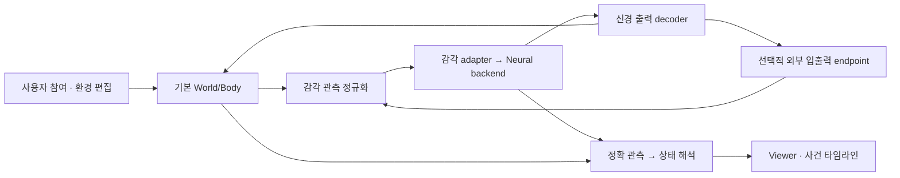

# Interactive Fly Sandbox — 사용자 참여형 시뮬레이션 수정 계획

수정일: 2026-09-13 · 상태: **계획 승인 요청 없이 사용자 요구를 반영한 설계 문서 / 기능 구현 완료 아님**

이 문서는 장기 로드맵의 사용자 경험과 구현 우선순위를 구체화한다. 실행 순서는 반드시 **V4 → V5 → V6 → V7 → V8 → V9 → V10 → V11 → V12 → V13 → V14**다. 각 버전의 상세 구현 계획과 장기 로드맵이 출시 계약이다. 이 문서는 공통 UX·데이터 계약을 설명한다. 기존 버전 번호의 옛 의미는 폐기하며 새 버전별 문서를 따른다.

## 1. 최종 사용자 경험

사용자는 Viewer에서 **세계 안으로 들어가기**를 누르고, 파리와 같은 공간에서 게임처럼 이동하고 물체를 집거나 놓고, 다가가고, 먹이·빛·바람·접촉 도구로 상호작용한다. 뷰어 안에서 지형지물과 환경을 편집하고, 모든 상호작용에 대해 파리의 감각 입력·뉴런 활동·상태 해석·행동 변화를 함께 본다.

기본은 데스크톱 키보드/마우스의 1인칭 참여다. VR이나 사용자 자신이 파리의 관절을 조종하는 기능은 이 요구를 대신하지 않는다. 파리는 기존 감각→신경계→운동→몸 폐루프를 유지한다. 외부 게임을 연결할 수 있는 범용 입출력 장착 구조를 제공하되, **오버워치·레이싱·비행기게임용 실제 모듈은 만들지 않는다.**

“모든 것을 통제”는 환경의 모든 지원 속성을 Viewer에서 조회·편집·저장할 수 있다는 제품 계약이다. 온도·날씨·지형 등 요청된 범주는 아래 단계에서 모두 다룬다. 아직 구현되지 않은 물리/생리 효과는 미지원으로 표시하고 해당 구현 단계를 완료할 때까지 전체 목표를 완료로 부르지 않는다.

## 2. 현재 진도: 문서와 작업 트리의 차이

2026-09-13 조회한 HEAD는 `3ad60db` (`Prepare Virtual Fly Lab V4 implementation`). 코드에는 기존 미커밋 변경이 있다. 이번 계획 수정에서 그 구현을 덮어쓰거나 커밋하지 않는다.

| 영역 | 현재 확인한 증거 | 판단 / 다음 일 |
|---|---|---|
| V3 | `docs/reports/V3_VERIFICATION_REPORT_2026-09-13.md` 후속 수정 절: P1/P2 보완, 회귀 exit 0 보고 | 기존 검증 이력. 실제 메뉴 recording→Quit 수동 확인은 보고서상 별도 항목 |
| V4 | `LabSession.swift`의 lockstep/pause/session 상태, `main.swift`의 deterministicQueue 및 `--v4timingtest`, `protocol.py`, `test_v4.py` 존재 | **구현 진행 중 / 통합 인수 검증 필요**. NOT IMPLEMENTED 문구는 오래된 상태 |
| 세계 조작 | `lab_world.py`: box/sphere/wall/food 슬롯, 이동·크기·삭제, wind/touch/flash/temperature | 기존 기능 재사용. 범용 지형·날씨·플레이어는 후속 구현 |
| Viewer | `LabWindow.swift`: `LabArenaPlacementView`의 2D 배치, 별도 MuJoCo viewer / BrainView | 통합 3D 참여 화면으로 완성된 상태가 아님 |
| 감각 | `lab_world.py`의 온도 모드, `food_odor` 모델; 기존 감각 회귀 로그 | 냄새 source는 있음. 바람에 따른 냄새 수송은 현재 함수에 없음 |
| 뉴런 해석 | 기존 role/BrainSignals와 BrainView, 샘플 spike 표시 | 정확 관측·사건별 설명·욕구/정서 분류는 새 계약 필요 |
| 외부 게임 | 이 문서의 범용 입출력 요구 | 설치 가능한 게임 모듈이 이미 있다는 뜻 아님 |

이번 계획 점검에서 `./flygym-venv/bin/python flygym_bridge/test_v4.py`를 실제 실행하여 exit 0 / `ALL V4 TESTS PASS`를 확인했다. 이것은 mock 중심 Python 검사이며 Swift 빌드·real TCP·GUI의 재검증을 대신하지 않는다.

진도 판단은 소스 존재, 과거 로그, 이번 실행 결과, 실제 GUI 검증을 구별한다. 기존 `notes/validation/2026-09-13/` 로그만으로 모든 현재 dirty 변경이 검증됐다고 판단하지 않는다.

## 3. V4부터 V14까지 고정된 실행 순서

각 단계는 독립 실행 가능한 결과와 인수 증거를 남긴다. 선행 gate 실패는 먼저 고치되, 저장·mesh import·생물학 연구 전체가 끝나야 사용자 참여를 만들 수 있는 구조는 피한다.

| 버전 | 구현 결과 | 선행 조건 | 완료 gate |
|---|---|---|---|
| V4 | 진행 중 시간·세션 제어 마무리 | V3 구현 | fixed tick, 양쪽 pause, epoch, 중복 명령, applied tick |
| V5 | 통합 Viewer + 사용자 참여 기본 | V4 완료 | 1인칭 이동·실제 감각 반응·물체 놓기·기본 활동 카드 |
| V6 | 지형/환경 편집 첫 완결판 | V5 완료 | primitive·온도·바람·빛·scene 설정 저장 |
| V7 | 정확 뉴런 관측 + 사건별 해석 | V6 완료 | 정확 rate/raster·전후 비교·근거/unknown |
| V8 | 범용 외부 입출력 확장 기반 | V7 완료 | attach/detach·협상·fault fixture, 실제 게임 모듈 제외 |
| V9 | 세션 저장·개체 보존·재생 | V8 완료 | 전체 checkpoint·새 프로세스 이어하기·분기·이식 |
| V10 | 전체 환경 편집 확장 | V9 완료 | mesh/heightfield·온습도 field·날씨·냄새·접촉 미각 지원 검사 |
| V11 | 욕구·정서·각성 상태 모델 | V10 완료 | 체내 상태/신경 추정 분리·근거·교정·미지원 처리 |
| V12 | 해석과 행동의 타당성 검증 | V11 완료 | 사전 정의 benchmark·대조·holdout·불확실성 |
| V13 | 성능·장시간 안정성·사용성 | V12 완료 | 응답성·bounded queue·실제 Viewer 동선·장애 복구 |
| V14 | 궁극적 목표 통합 인수 | V13 완료 | 모든 사용자 동선·저장/재생·환경·분류·모듈 기반 종합 검증 |

V5 기본 카드는 기존 측정의 명확한 표시만 먼저 제공한다. V7 정확 측정이나 V11 욕구 모델의 완료를 가장하지 않는다. V6 scene 설정 저장은 뇌 상태 이어하기가 아니며, V9 checkpoint와 메뉴 이름도 구별한다.

## 4. Viewer와 사용자 참여

### 화면 구조

- 중앙: 충분히 큰 3D world viewport. 기본 작업은 이 화면에서 끝난다.
- 위: 참여/관찰/편집 모드, 실행·일시정지·한 단계 진행, simulation 속도, 저장.
- 왼쪽 접이식: 월드 객체·지형·환경·도구·모듈 목록. 선택 시 필요한 속성만 펼친다.
- 오른쪽: 선택 파리의 상태 카드 → 그룹 활동 그래프 → 개별 뉴런 상세 순으로 확장.
- 아래 접이식: 사용자 상호작용과 환경 변화가 붙는 공통 타임라인, 사건 선택/전후 비교.
- 지연/미지원/적용 실패는 해당 조작 옆에 표시한다. 내부 packet/epoch 수치는 진단 패널에 두고 일상 조작에 요구하지 않는다.

### 참여 / 관찰 / 편집의 의미

| 모드 | 조작 | 파리에게 생기는 영향 |
|---|---|---|
| 관찰 | orbit, 자유 카메라, 추적, 파리 눈 영상 | 카메라 이동 자체는 물리·신경 입력을 만들지 않음 |
| 참여 | WASD 이동, 마우스 시선, E 상호작용, 도구 사용, Esc 커서 해제 | 세계 안의 사용자 몸/손/probe가 시각·접촉에 실제 반영 |
| 편집 | 객체 선택, 이동/회전/크기 gizmo, 지형 brush, 속성 입력 | 명시적 world command로 적용, 사건 기록 |

키는 초기 기본값이며 재매핑 가능하게 한다. 입력 포커스가 text field에 있으면 이동/도구 단축키를 소비하지 않는다. 포커스 상실·Esc·disconnect에는 held input을 해제한다. 가벼운 파리 크기의 avatar/probe를 기본으로 하고 크기·이동속도·충돌 반경을 설정한다. 인간 크기 표현은 mm 좌표 변환과 공간 범위가 검증된 뒤 preset으로 제공한다.

**카메라만 이동시키고 파리가 사용자를 못 보는 상태는 참여 기능의 완료가 아니다.** 참여체는 physics와 eye renderer에 같은 pose/geometry로 존재해야 한다. 접촉은 충돌 지점·법선·힘으로 기록하며 클릭 거리만으로 접촉을 만들지 않는다. 시각적 손 모델은 초기에는 단순 geometry여도 되지만 표현과 실제 충돌 위치가 일치해야 한다.

파리 시점 모드는 실제 eye image와 사람용 추적 카메라를 구별한다. 후자를 파리의 실제 시각으로 표시하지 않는다. 기본 참여 제어권은 사용자 avatar에 있고, 파리 운동은 신경계가 결정한다.

### 구현 경계

V5에서 현재 MuJoCo viewer 내장 확장 가능성과 native viewport 연결을 작은 prototype으로 비교한다. 선택 기준은 동일 physics scene 사용, picking/depth, keyboard focus, 눈 영상의 참여체 가시성, 프레임 비용이다. 문서만 보고 지원 API를 가정하지 않는다. 기존 AppKit host와 simulation-owner를 유지하며 렌더러를 바꾸더라도 두 번째 physics world를 만들지 않는다.

새 후보: `WorldViewer.swift`, `PlayerController.swift`, `WorldInteraction.swift`, Python `player_body.py`. `LabWindow.swift`는 공통 shell과 패널 조합으로 줄이고 기존 2D 배치는 보조 minimap으로 재사용한다. scene pose snapshot은 복사/버전 관리하여 UI가 MuJoCo state를 직접 변경하지 않는다.

첫 인수: 사용자가 참여→파리 앞에 이동→물체 놓기→물체로 접근→파리의 눈에 보임/접촉 확인→감각과 활동 변화 확인→pause→관찰 전환을 새 프로세스에서 수행한다. 파리가 반드시 특정 방향으로 도망가도록 성공 조건을 조작하지 않는다.

## 5. Viewer에서 모든 환경을 통제하는 계약

환경의 새 속성을 추가할 때 `EnvironmentPropertyDescriptor`에 ID, 이름, 단위, 타입, 유효 범위, 기본값, 전역/국소 범위, 적용 방식, 저장 여부, 지원 효과를 함께 등록한다. 기본 조작은 간단한 slider/방향 화살표/색·재질 선택으로 제공하고 정밀 수치와 고급 모델은 펼쳐서 편집한다. 코드에만 있고 UI에는 없는 설정을 방치하지 않는다.

| 범주 | 사용자 제어 | 단계 / 효과 검증 |
|---|---|---|
| 지형·지물 | 바닥/벽/경사/장애물, 이동·회전·크기·복제·삭제, heightfield brush/mesh | V6 primitive, V10 terrain. 실제 충돌과 표시가 일치 |
| 표면·물리 | 마찰·탄성·질량/고정 여부, 중력·물리 시간 설정 | 지원 범위를 descriptor로 제시. 불안정 설정은 적용 전 검증 |
| 온도 | 전역 °C, 국소 hot/cold 영역, 시간 변화 | V6 기존 온도 모드, V10 공간 field. 환경값/감각/생리 효과를 구별 |
| 바람 | 방향·강도·지속/돌풍·국소 풍원, 흐름 화살표 | V6 기존 force, V10 공간 field. 현재 정규화 strength를 검증 없이 m/s로 개명하지 않음 |
| 습도 | RH %, 국소 source·건조 영역 | V10 HRN 모델과 연결하고 실시간 sample 확인 |
| 조명·시간 | 밝기·색·방향·그림자·낮밤·광원/flash | V6 기본, V10 확장. 눈에 들어간 실제 sample을 함께 표시 |
| 날씨 | 맑음/흐림/안개/비/눈 preset, 강수량·변동 seed | V10. 각 preset은 여러 field를 묶은 저장 가능한 설정 |
| 냄새·먹이 | 위치·농도·종류·공간 범위·풍하 수송 설정 | V6 기존 source, V10 field/transport. 먹이 배치와 섭식 구현 구별 |
| 접촉·진동 | 물체/도구의 접촉·진동 source·강도·시간 | V6 기존 접촉, V10 지원 effect. geometry와 receptor 경로 확인 |

날씨 preset은 실제 연결 효과를 표시한다. 예를 들어 비의 시각 연출, RH 변화, 충돌/표면 젖음은 서로 다른 지원 항목이다. 비 입자만 보이면 강수 물리 완료가 아니다. 눈·젖음·열전달 등은 구현 전 모델/단위/비용 검증을 거친다. 음향 같은 추가 속성도 동일 descriptor로 확장하며 receptor가 없으면 환경 또는 연출 전용으로 남긴다.

전역 값+국소 source/zone의 합성 규칙을 명시한다. field별 override/additive 정책, 우선순위, clamp와 단위를 저장하고 파리 위치의 **최종 sample**을 probe로 확인한다. stochastic weather는 seed와 simulation tick으로 재현한다. UI/renderer/sensory adapter가 각자 다른 날씨를 계산하지 않는다.

편집 lifecycle은 preview→검증→simulation 경계 apply→ACK→확정이다. slider preview는 적용된 값처럼 표시하지 않으며 취소할 수 있다. 연속 drag는 coalesce하고 최종 적용값과 tick을 기록한다. topology 변경은 pause→staged compile→충돌/초기 pose 검증→swap, 실패 시 기존 world 유지다.

Undo/redo는 설정 명령의 되돌리기다. 이미 진행된 물리·신경 시간까지 되돌리는 기능은 V9 checkpoint 분기로 제공한다. drag 대신 수치 입력/이동 버튼도 제공하고 키보드로 선택·편집·취소할 수 있게 한다.

## 6. 외부 게임 입출력 모듈 장착 구조 — 실제 모듈 제작 제외

### 데이터 경로

외부 endpoint는 두 방식의 capability를 선언한다: `auxiliary`(자극/관측/출력 보조) 또는 `external_environment`(외부 환경이 상태 소유자). 후자는 MuJoCo body와 동시에 같은 제어 대상의 소유자가 되지 않는다. 사용자가 모듈 패널에서 경로와 제어권을 확인한 뒤 세션을 시작한다.

- `ObservationFrame`: session/epoch/seq/source tick, source clock/수신 시각, typed channels, 단위·좌표계, 유효성, 이미지 크기/포맷/참조, TTL.
- `ActionFrame`: source neural tick, target endpoint, typed continuous/discrete actions, 범위, 유효 기한, 원인이 된 decoder/config 버전.
- `ModuleDescriptor`: ID/version/API schema, capabilities, input/output schema, coordinate/unit conventions, sample rates, clock mode, deterministic/restore 지원, resource limits.
- lifecycle: discover→validate→attach→configure→ready→running→draining→detached, 오류 시 failed. 런타임 조회 결과로 UI controls 생성.
- 기본 session envelope는 V4 계약을 재사용한다. 고주파 영상은 control NDJSON에 base64로 계속 밀지 않고 크기 제한된 별도 frame transport를 협상한다.

관측/출력 adapter는 독립적으로 등록할 수 있다. 외부 게임이 제공한 이미지는 감각 encoder를 거쳐야 하며 그 작업이 미래 모듈 제작 범위임을 명시한다. 현재 neural 출력이 steering/walk뿐이면 현재 지원 채널만 노출한다. FPS 조준/발사, 레이싱 가감속, 비행 조종이 자동으로 가능한 것으로 표시하지 않는다.

외부 게임에서 받은 reward/event도 선언된 adapter와 학습/내부상태 모델 없이는 새로운 욕구나 학습으로 바뀌지 않는다. 기본 경로는 자연 감각이며 raw neuron injection은 별도 눈에 띄는 direct-neural 실험 capability로 구분한다.

clock은 lockstep 지원 peer와 wall-time 외부 peer를 분리한다. 후자는 interactive-only이고 latency/jitter/drop을 기록한다. 서로 다른 clock을 억지로 동일 tick으로 취급하지 않는다. continuous action은 latest-wins, discrete action은 bounded FIFO+ID 중복 제거; epoch 전환에서 이전 action/ACK 폐기. pause·focus loss·timeout·detach에서 held action 해제/neutral output 후 ACK 또는 실패 상태를 남긴다.

장착/제거는 session barrier에서 수행하고 연결 검증 실패 시 정상 기존 경로를 유지한다. 모듈 crash가 neural/UI process를 종료하지 않도록 외부 endpoint는 별도 프로세스 경계로 둔다. 파일 import는 임의 코드 실행이 아니며 설치된 adapter만 실행한다. 모듈 목록/상태/채널 mapping/단위 변환/지연/test/disconnect를 Viewer에서 제공한다.

V8 대상 파일 후보: `ModuleRegistry.swift`, `ExternalIOProtocol.swift`, `ExternalIOSession.swift`, `schemas/external-io.schema.json`, `fixtures/external-io/`. 시험용 fixture/loopback은 제품 게임 모듈이 아니다. 유효·미지원 버전/잘못된 단위/과대 frame/late frame/중복 action/crash/detach/stuck-held-input을 검증한다. 완료 산출물은 계약 문서·호스트 장착 기반·왕복 fixture이며 실제 게임 연결을 완료 주장하지 않는다.

## 7. 뉴런 활동을 욕구·정서·흥분도로 이해하기

목표는 사용자가 상호작용할 때 **무슨 입력을 받았고 어떤 신경 집단이 변했으며 어떤 상태/행동과 관련될 수 있는지** 읽는 것이다. 사람의 문장 형태 생각이나 주관적 감정을 직접 측정한 것으로 표시하지 않는다.

### Viewer의 세 층

1. **측정:** 실제 simulation spike/rate/모델 전위, 입력 전류, 집단 membership와 시간 창.
2. **상태 해석:** 흥분/각성, 위협·회피 관련, 이동/그루밍 관련, 감각 처리, 향후 배고픔/갈증/피로·휴식/보상 관련 상태.
3. **설명:** “접근 사건 이후 시각 위협 관련 집단 활동 증가, 도피 출력 발생” 같은 관측 기반 문장. 인과 대조가 없으면 “이것 때문에”라고 단정하지 않음.

| 분류 | 초기 사용 가능한 기반 | 표기/제한 |
|---|---|---|
| 각성·흥분 | 현재 population rate 및 `BrainSignals.arousal` | 모델 각성 지표; 생물학적 확률/감정 점수 아님 |
| 위협·회피 관련 | LC4/LPLC2, GF와 해당 출력 | 감각/도피 관련 활동; “공포를 느낌”으로 단정하지 않음 |
| 운동 경향 | DNp09, DNa01/02, MDN, DNg11, wing 관련 기존 role | 운동 신호와 실제 body 실행을 구분; 미지원 몸 행동은 미지원 |
| 감각 처리 | 기존 온도/냄새/바람 집단 | 자극 수용과 욕구 충족/선호를 동일시하지 않음 |
| 배고픔·갈증 | V11 내부 에너지/수분 상태 및 검증된 mapping 필요 | V5/V7에는 수치 없이 “모델 미구현” |
| 피로·휴식 욕구 | 모델과 수면/각성 측정의 검증 필요 | 현재 sleep gate나 비활동만으로 실제 피로 점수를 생성하지 않음 |
| 보상·혐오·정서 관련 | primary annotation, 상태 모델, 대조 실험 필요 | 알려진 범위만 모델 추정; 행복/분노 등을 임의 분할하지 않음 |

전체 뉴런을 욕구/감정으로 강제로 나누지 않는다. 한 뉴런은 여러 기능 그룹에 포함될 수 있고 `unclassified`도 유지한다. 그룹 합계가 전뇌 활동의 배타적 분할인 것처럼 합산하지 않는다. dataset/root ID로 연결하고 이름 substring이나 soma 위치만으로 감정 역할을 지정하지 않는다.

`NeuralGroupDefinition`: ID/label, root IDs 또는 재현 가능한 membership query, dataset hash, 기능 태그, 출처, evidence tier, 정상화/시간 창, baseline 조건, decoder version. **primary literature/annotation 검증은 새 분류 구현의 선행 작업**이며, 이번 문서의 후보 표는 새로운 생물학적 타당성 검증 결과가 아니다.

`StateEstimate`: category, value 또는 null, unit, valid/unsupported/insufficient_data/stale, evidence tier, contributing groups, time window, decoder version. 검증되지 않은 confidence percent를 만들지 않는다. 확률 모델을 실제 교정한 경우에만 calibration 근거와 확률을 표시한다. 체내 에너지와 neural 욕구 추정은 별도 값으로 비교한다.

V7은 `SpikeBus` 시각 표본과 분리된 정확 `ObservationStream`을 만들고 선택 집단/뉴런 rate/raster를 집계한다. rate 단위(뉴런당 평균/합계), baseline 대비 변화, 집계 창/EMA tau, sample loss를 보여준다. 기본 표본 반짝임에서 정확 점수/순위를 추론하지 않는다. 선택 클릭은 관찰이며 자극은 별도 도구다.

### 상호작용별 설명

모든 사용자 사건에는 event ID, 요청 시각/실제 적용 tick, actor/tool/target, 환경 효과, 감각 sample 시각을 붙인다. 최근 pre-event buffer와 configurable post-event window를 유지하고, 오른쪽 카드에 사건 전후 차이와 top contributing groups를 표시한다.

초기 비교 창은 전 0.5 s/후 1 s의 simulation time을 제안값으로 두고 수정 가능하게 한다. 종료 전에는 “관측 중”, baseline 부족/여러 사건 중첩/센서 누락이면 명시한다. 5 Hz 시각 sample에서 1 ms 입력 시점을 꾸미지 않는다. 동일 사건 선택 시 월드 marker·감각·뇌·실제 움직임 그래프가 같은 시간축으로 맞아야 한다.

설명은 `applied event → sensed input → observed neural change → decoder output → measured body action`의 기록을 사용한다. 바람이 몸을 직접 민 경우와 신경 출력으로 움직인 경우를 나누어 표시한다. 무반응도 정당한 결과다. 설명을 자연스럽게 만들기 위해 없는 상태를 채우지 않는다.

V11은 상태 모델별 독립 구현이다. 신경 추정과 체내 상태를 versioned 모델로 추가하고 same-seed/no-input, 제거/자극 대조, 학습용과 holdout 데이터 분리로 검증한다. decoder는 읽기 전용이며 카드 값을 다시 뇌에 입력하는 숨은 feedback을 만들지 않는다. 생리 feedback이 필요하면 명시적 모델 경로로 따로 검증한다.

대상 후보: `NeuralObservation.swift`, `NeuralGroupRegistry.swift`, `StateDecoder.swift`, `InteractionTimeline.swift`, `BrainInspector.swift`, `data/annotations/functional_groups.json`. shader 변경 시 기존 CPU/GPU reference 검증을 필수로 한다.

## 8. 상태 소유권과 저장

- session은 tick, pause, reset, command ordering의 단일 소유자다.
- world/backend는 geometry·physics·환경 field의 권위 상태를 가진다.
- player input은 command이고 viewer pose/설명은 읽기 전용 snapshot이다.
- neural backend는 뉴런 상태를, state decoder는 versioned 해석을 소유한다.
- recorder는 event ID로 요청/적용/관측/출력 관계와 config hash를 연결한다.

V9 전체 checkpoint는 V9 상세 계획의 neural/controller/body/sensory/recorder 상태 목록에 player pose/held input 처리 정책, 환경 field/날씨 RNG, 모듈 descriptor/state, decoder filter/baseline을 추가한다. replay 전용 camera preference와 물리에 영향을 주는 player pose를 구분한다. 외부 peer가 restore를 지원하지 않으면 그 세션을 무손실 이어하기로 표시하지 않는다.

## 9. 성능과 검증 목표

첫 목표값이며 현재 달성 보고가 아니다: viewport 30 FPS 이상, UI 조작 피드백 p95 100 ms 이하, 활동 카드 10 Hz, full brain 시각화는 별도 budget. **화면 반응, body simulation/wall 비율, 신경 tick, 감각 sample 주기는 따로 측정한다.**

V5 prototype에서 기준 장비·해상도·vision 설정별 실측을 남기고 통과 기준을 확정한다. 비실시간 physics에서도 입력 접수/적용 대기 상태는 즉시 보여준다. 그래픽을 줄이거나 simulated time을 늦출 수 있지만 실험 tick을 건너뛰지 않는다. 영상·뇌 데이터·recording 큐는 제한을 두며 overflow를 숨기지 않는다. 10분 및 최종 30분 soak에서 메모리/queue/지연 추세를 확인한다.

기존 회귀 명령은 V4 계획을 따른다. 새 단계는 physics 접촉/눈 가시성, 편집 rollback, field 단위와 합성, 이벤트 시간 정렬, 정확 집계, module fault, checkpoint continuation을 해당 단계에서 검증한다. 문서 수정만으로 전체 runtime suite를 다시 돌릴 필요는 없지만 완료 보고서는 **실제로 실행한 검사만** 기록한다.

## 10. 다음 구현자가 바로 할 일

1. `git status`, V4 문서와 현재 `LabSession.swift`/`main.swift`/Python protocol을 대조하고 기존 변경을 보존한다.
2. V4: `--v4test`, `--v4timingtest`, Python `test_v4.py`, mock/real `--v4loop`, V4 회귀와 fresh viewer smoke를 수행해 누락/실패를 수정한다. 실행 전 현재 CLI/launcher 옵션을 확인한다.
3. V4 완료 보고서를 작성한 뒤 V5 viewport prototype으로 렌더/picking/참여체 가시성 경계를 확정한다.
4. V5: 기본 arena에서 1인칭 참여체+물체 배치+기존 activity 카드의 작은 수직 통합을 구현한다. V6 이후 기능을 한 번에 끼워 넣지 않는다.
5. 각 버전 착수 시 수정 파일, schema, 테스트 fixture, 오류 처리, GUI 완료 동선, 성능 기준을 단독 구현 계획으로 구체화한다.
6. 상태 표에는 `planned / implementing / automated_verified / gui_verified / complete`를 구별하고 미지원 효과 및 다음 단계 의존성을 기록한다.

## 11. 최종 인수 시나리오

새 앱 프로세스에서 사용자가 문서/터미널 없이 다음을 수행해야 V14 제품 목표를 완료로 표시한다.

1. world를 열고 “들어가기”로 이동한다. 파리 앞에 접근하고 물체를 집어 옮긴다.
2. 파리가 사용자 참여체를 실제 눈/접촉 경로로 감지하고, 관련 neural/body 사건이 기록된다.
3. 지형을 높이고 벽·경사·표면을 편집한다. 잘못된 compile은 기존 세계를 보존한다.
4. 온도·습도·바람·빛·날씨·냄새를 바꾸고, 파리 위치의 적용값과 지원 효과를 확인한다.
5. 각 상호작용에서 욕구/정서/각성 카드를 열어 실제 측정과 모델 해석, 근거/미지원 상태를 구분한다. 원인이 불명확한 반응은 불명확하게 표시한다.
6. 사건을 골라 전후 감각/뉴런/출력/몸 움직임을 같은 시간축으로 확인하고 개별 뉴런까지 내려간다.
7. pause하면 양쪽 시뮬레이션과 날씨/도구 timer가 멈추고 Viewer 탐색은 계속된다.
8. 세계 설정과 전체 세션을 각각 저장하고 재시작 후 이어한다. 기록 보기·재실행·분기는 구분된다.
9. 모듈 패널에서 시험 endpoint를 장착하고 입출력 왕복/분리/timeout 해제를 확인한다. 실제 게임 모듈은 설치되어 있지 않아도 확장 기반 검증은 통과한다.
10. 성능 측정, 기존 회귀, 실제 Viewer 동선 검증 결과와 미지원 효과를 완료 보고서에 남긴다.

V11에서 근거를 확보하지 못한 욕구/정서 항목은 연구 미완료로 유지한다. 기술적으로 정직한 unknown 표시와 해당 상태를 이해하는 궁극적 목표의 미달성을 함께 기록한다.
